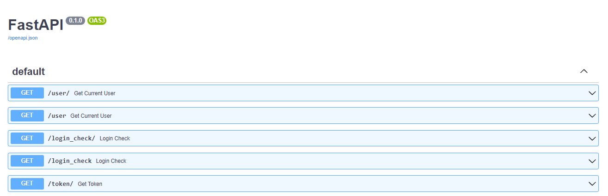
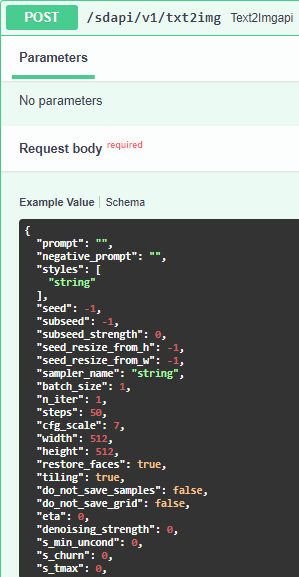

# Stable Diffusion Discord Bot

## Installation

```bash
py -3 -m pip install discord-py-interactions --upgrade
```

## Usage
#### First, run the web UI with the --api command added to the command line.
- set COMMANDLINE_ARGS=--api

#### Store the key of your Discord bot as TOKEN=<YOUR-TOKEN> in the env file. 
#### Your URL address is probably http://127.0.0.1:7860. If not, save the URL as it is.
- Also you can see API docs if you go [URL/docs](http://127.0.0.1:7860/docs).


 


You can see alternative posts for text2img here.





For this bot, only the following were used: prompt (of course!), style, negative_prompt, steps, width, and height.


To start your bot, use the following command:
```python
python main.py
```

#### Now, you can create images as you wish with your friends on Discord using Stable Diffusion!
## License
[Apache 2.0](https://choosealicense.com/licenses/apache-2.0/)